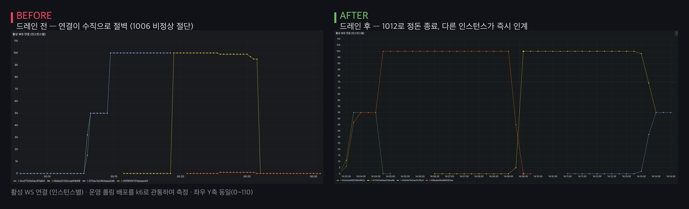
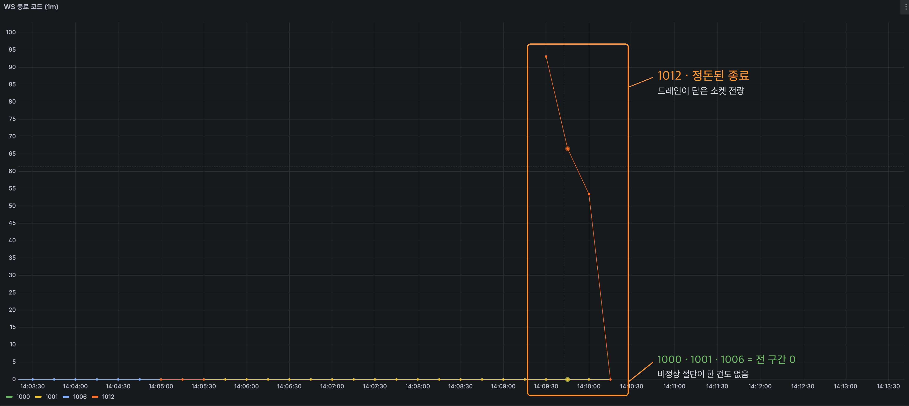
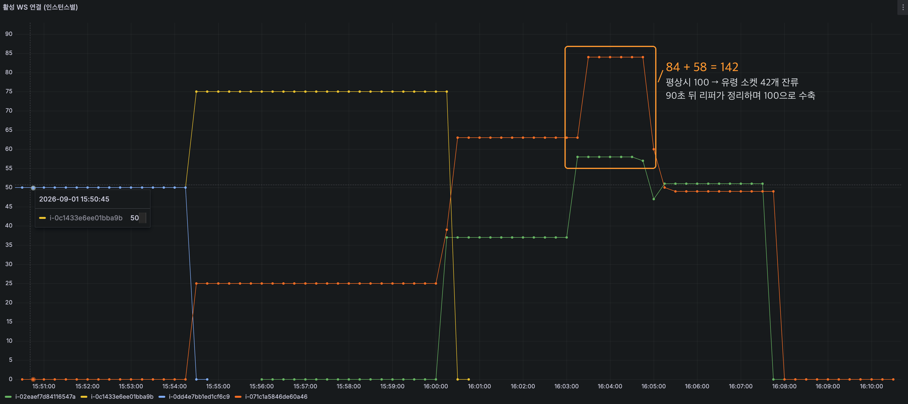
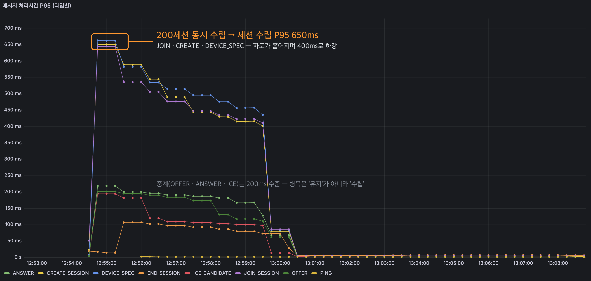
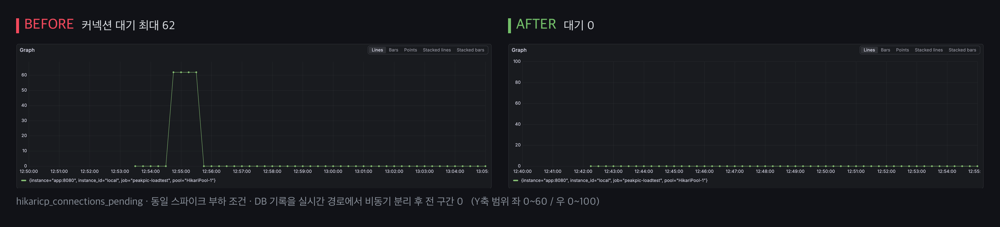

# PeakPic — 백엔드 · 인프라
> 두 스마트폰을 WebRTC P2P로 연결해, 찍히는 사람이 촬영자의 화면을 보며 직접 구도를 지휘하는
> 협업 촬영 앱. **Google Play 출시·운영 중** (AI·SW마에스트로 17기, 팀 4인)
<br>
사진을 부탁하면 구도가 마음에 안 드는 문제를, 두 스마트폰을 WebRTC P2P로
연결해 찍히는 사람이 촬영자의 화면을 보며 직접 구도를 지휘하는 방식으로 풀었습니다.


📱 [Google Play](https://play.google.com/store/apps/details?id=soma.project.caestro&hl=ko) · ✍️ [기술 블로그](https://velog.io/@ryu2293/posts)

---

## 서버가 책임지는 것

연결이 곧 제품인 서비스입니다. 영상은 두 기기 사이를 P2P로 직접 오가고, 서버는
**두 기기를 연결해 주고 그 연결을 살아있게 유지**하는 일을 합니다 — 시그널링, 세션 상태, 인증,
TURN, 그리고 배포·장애·네트워크 전환에서의 연결 보호.


> 미디어(영상) 트래픽은 앱 ↔ 앱 P2P로 직결되어 우리 인프라를 경유하지 않습니다.
> P2P 연결에 실패할 때만 TURN(coturn) relay를 거칩니다.

| | |
|---|---|
| 규모 | t3.micro 2대 · 동시 1000세션 처리 검증 |
| 중계 성능 | ICE 중계 p95 **21ms** · 중계 유실 **0** (16,080/16,080) |
| 배포 안정성 | 롤링 배포 관통 측정 세션 복원 **150/150** · 세션 사망 **0** |
| 스택 | Java 21 · Spring Boot · WebSocket · Redis · MySQL · AWS(ASG/ALB/Lambda/ECR) · coturn · Docker · k6 · Prometheus/Grafana |

---

## 1. “절대 안 끊기게 만들기”보다 “언제든 끊길 수 있다고 가정하고 빠르게 복구하기”

WebSocket 연결은 세 가지 방식으로 끊깁니다 — **우리가 배포할 때**, **사용자의 망이 바뀔 때**,
그리고 **죽었는데 살아있어 보일 때**. 셋을 차례로 해결했습니다.

### ① 배포할 때 — 드레인

배포할 때마다 연결된 WebSocket이 전부 끊겼습니다. 고치기 전에 먼저 쟀더니, k6로 세션 40개를
유지한 채 배포하자 전 소켓이 1ms 안에 1006(비정상 절단)으로 동시 종료됐고 서버에는 예외 40건이
남아 있었습니다. **Redis 연결 빈이 소켓보다 먼저 파괴**되는 종료 순서 결함이었습니다.

`SmartLifecycle`로 종료 순서에 끼어들어, 빈이 파괴되기 전에 소켓을 1012로 정리하는 드레인을
구현하고 끊는 시점을 0~3초로 분산했습니다(동시 종료 처리 지연 992ms → 4ms). 클라이언트와는
재연결 계약을 문서로 합의했습니다 — 종료 코드별 행동, 지수 backoff, 같은 토큰으로 자리
인계(takeover), 상태 스냅샷 복원.

**운영에서 한 번 더 틀렸습니다.** 로컬에선 완성이었지만 운영 배포에선 1012가 0건이었습니다.
끊는 주체가 SIGTERM이 아니라 **ALB 등록 해제(30초)** 였습니다. AWS 문서로 확인한 뒤,
EC2 메타데이터(IMDS)의 수명주기 상태를 2초 주기로 폴링해 "종료가 결정된 순간" 드레인하도록
재설계했습니다.



> 드레인 전에는 한 인스턴스의 연결이 통째로 사라진 뒤에야 다른 인스턴스가 받기 시작합니다(좌).
> 드레인 후에는 끊김과 인계가 겹쳐 일어나 전체 연결 수가 유지됩니다(우).



> 같은 배포를 관통한 종료 코드 분포. 비정상 절단(1006)이 한 건도 없다는 것이 드레인이
> 실제로 동작했다는 증거입니다.

| | before | after |
|---|---|---|
| 종료 코드 | 1006 × 150 (비정상 절단) | **1012 × 150** (정돈된 종료) |
| 세션 복원 | — | **150 / 150** |
| 복원 시간 | — | med 0.61s · p95 1.07s |
| 세션 사망 | 전량 | **0** |

### ② 망이 바뀔 때 — 재연결 계약

모바일은 Wi-Fi ↔ LTE 전환으로 수시로 끊깁니다. 끊김을 막을 수 없다면 **빠르게 복구**하는 것이
목표입니다. 종료 코드별로 클라이언트 행동을 정의했습니다.

| 종료 코드 | 의미 | 클라이언트 행동 |
|---|---|---|
| 1012 | 서버 재시작(드레인) | 0~1초 무작위 대기 후 즉시 재접속 |
| 1006 · 코드 없음 | 비정상 절단 | `min(1s × 2^n + random(0~1s), 30s)` 지수 backoff |
| 1008 | 정책 위반 | 재접속 금지 — 원인 해소 후 |

재접속은 **같은 토큰**으로 JOIN해 서버가 자리를 인계하고, 공백 동안 놓친 상태는 이벤트 replay가
아니라 `SESSION_RESUMED` 스냅샷으로 복원합니다. 시그널링 상태는 작고 SDP/ICE는 재생성이
관례라, 스냅샷이 더 단순하고 안전하다고 판단했습니다.

### ③ 죽었는데 살아있어 보일 때 — 하트비트 리퍼

배포도 망 전환도 아닌 경우가 남습니다. 앱이 강제 종료되거나 네트워크가 사라지면 TCP 연결이
half-open 상태가 되어, **서버 입장에서는 소켓이 멀쩡해 보입니다.** 클라이언트가 25초마다 PING을
보내고, 90초 이상 조용한 소켓을 30초 주기로 정리하는 하트비트 리퍼를 뒀습니다. PING을 서버가
아니라 클라이언트가 보내게 한 것은 이식성 때문입니다.

계획에 없던 장면이 배포 측정 중에 잡혔습니다.



> 배포를 관통해 측정하던 중 측정 기기의 Wi-Fi가 순단되며 42개 소켓이 코드 없이 끊겼습니다.
> 서버는 이 끊김을 보지 못해 활성 연결 합계가 100에서 142로 부풀었고(죽은 소켓이 유령으로 잔류),
> 90초 뒤 리퍼가 정리하며 100으로 수축했습니다. 42건 전부 backoff 재접속으로 복원되어
> 세션 손실은 0이었습니다 — 계획에 없던 실제 장애를 재연결 계약과 리퍼가 함께 흡수한 셈입니다.

---

## 2. 부하테스트가 찾은 진짜 병목

1 VU가 방장·참여자 소켓 2개를 모두 열어 실제 프로토콜 흐름(로그인 → 세션 생성 → 입장 →
SDP/ICE 교환 → 유지)을 재현하는 k6 시나리오를 설계하고, 페이로드에 전송 시각을 심어
편도 지연을 측정했습니다.

동시 1000세션 **유지**는 여유였습니다. 문제는 동시 **몰림**이었습니다.



> 한계를 좌우한 건 "동시 세션 수"가 아니라 "동시 수립 수"였습니다.

지표를 분해해 병목을 두 곳에서 찾았습니다.

- **중계 1건당 Redis 순차 5.3왕복** → Lua 스크립트로 정확히 1왕복
- **세션 수립 경로의 DB 동기 기록** → 비동기 큐로 분리



> 커넥션 대기가 최대 62까지 쌓였고, DB 기록을 실시간 경로에서 떼어낸 뒤 전 구간 0이 됐습니다.

| 스파이크 P95 | before | Lua 적용 | DB 분리 | 누적 |
|---|---|---|---|---|
| 세션 수립(JOIN) | 408ms | 409ms | 200ms | **-51%** |
| 세션 생성(CREATE) | 397ms | 389ms | 191ms | **-52%** |
| relay SDP | 598ms | 423ms | 212ms | **-65%** |
| relay ICE | 992ms | 656ms | 552ms | **-44%** |

평상 부하는 회귀 없이 유지(4ms → 3ms)됐고, 운영 검증에서 670세션 · 중계 유실 0(16,080/16,080)을
확인했습니다.

---

## 3. 서버가 2대가 되는 순간

처음에는 세션 상태를 서버 메모리에 뒀습니다. 인스턴스가 하나일 때는 아무 문제가 없었습니다.

가용성을 위해 인스턴스를 2대로 늘린 순간 시그널링이 깨졌습니다. **소켓은 프로세스에 묶여
있기 때문**입니다. 촬영자가 A 서버에, 디렉터가 B 서버에 붙으면 A는 상대의 소켓을 갖고 있지
않아 SDP·ICE가 전달되지 않습니다. 로드밸런서가 두 사람을 같은 서버로 보내줄 이유는 없으므로,
연결을 맺어주는 기능 자체가 확률적으로 실패하는 상태였습니다.

### 무엇이 필요한지부터 적었다

Redis Pub/Sub과 Kafka를 놓고 비교했는데, 기준을 "트래픽이 크냐 작냐"로 잡으면 답이 나오지
않습니다. 우리에게 실제로 필요한 성질이 무엇인지부터 정리했습니다.

| 필요한 성질 | 우리 서비스에서는 | Redis Pub/Sub | Kafka |
|---|---|---|---|
| 지금 연결된 소켓으로 즉시 fan-out | **필수** — 시그널링은 실시간이 전부 | 적합 | 가능하지만 무거움 |
| 구독자가 죽었을 때 메시지 보존 | **불필요** — 받을 소켓이 없으면 메시지도 무의미 | 없음 | 있음 |
| 과거 이벤트 replay | **오히려 해로움** | 없음 | 있음 |
| 독립 consumer group · 처리 이력 | 불필요 — 소비자는 서버 인스턴스뿐 | 제한적 | 있음 |
| 추가 운영 부담 | 최소화 필요 — 세션 상태용 Redis가 이미 있음 | 없음(재사용) | 브로커 운영 추가 |

결정적이었던 것은 세 번째 줄입니다. 시그널링 메시지는 **지금 그 소켓에 닿아야만 의미가
있습니다.** 상대가 이미 끊긴 뒤 도착한 ICE 후보는 쓸모가 없고, 재접속한 세션에 옛 SDP를
replay하면 오히려 협상이 깨집니다. 우리 메시지는 본질적으로 at-most-once이고, Kafka가 파는
durability·replay는 여기서 **가치가 0이거나 음수**였습니다. 재연결 시 상태 복원은 이벤트
replay가 아니라 `SESSION_RESUMED` 스냅샷으로 이미 해결해 둔 것도 같은 이유입니다.

> "작으면 Redis, 크면 Kafka"가 아니라 — **메시지가 보존되어야 하는가**로 갈립니다.
> 지금 구조에서 Kafka를 다시 검토할 조건은 트래픽 증가가 아니라, 서버 인스턴스 외의 독립 소비자(분석 파이프라인·알림 발송 등)가 같은 이벤트를 필요로 하게 되는 시점입니다.

---

## 4. 외부 장애가 전염되지 않게

가짜 침묵 서버(모든 요청에 120초 무응답)로 장애를 주입하고, 공격 200 VU가 소셜 로그인을 연타하는
동안 무관한 게스트 로그인 10 VU가 어떻게 되는지 측정했습니다.

```
[before] 외부 호출 타임아웃 없음
  bystander_guest_ms ....... avg=1s       max=58.2s    ← 카카오와 무관한 API
[after]  타임아웃 3s + 서킷브레이커
  bystander_guest_ms ....... avg=38.5ms   max=1.37s
  attack_503_circuit_open .. 166,842건    med 5.7ms에 즉시 거절
```

외부 호출에 타임아웃이 없었고, 모놀리스는 톰캣 스레드풀을 전 기능이 공유하기 때문입니다.
로그인 대기가 스레드를 고갈시키면 WebSocket 연결까지 마비됩니다.

**어디에 안 거는가도 설계의 절반이었습니다.**

- **4xx는 서킷 표본에서 제외** — 만료 토큰 폭주로 서킷이 열리면 불량 요청이 정상 사용자의
  로그인까지 차단하는 자기 DoS가 됩니다
- **1회성 인가코드는 재시도 금지** — 재시도가 성공은커녕 `invalid_grant`를 만듭니다
- **폴백이 없는 실시간 경로의 DB·Redis에는 서킷 미적용** — 차단해도 대신할 것이 없습니다

가설과 다른 결과도 나왔습니다. **서킷이 열려 있어도 이미 나간 요청은 스레드를 계속 쥐고
있었습니다.** 서킷은 새 호출만 막고, 인질은 타임아웃만이 회수합니다. 둘이 세트인 이유를
숫자로 배웠습니다.

릴리스 직전에는 제가 만든 레이트리밋이 우리 부하테스트를 차단한다는 것을 발견했습니다
(k6가 한 IP에서 토큰 100개를 발급). 같은 구조의 오탐이 통신사 공유 IP(CGNAT) 뒤의 실사용자에게
일어날 수 있어, 한도를 조정하고 오탐 관측 지표를 추가해 추정치를 실측으로 교정할 루프를
만들었습니다.

---

## 5. 배포 파이프라인과 인프라

jar를 S3에 올려 부팅 시 마운트하던 방식을, 멀티스테이지 Docker 이미지 + ECR +
GitHub Actions로 재구축했습니다. 인증은 장기 IAM 키 대신 **OIDC 임시 자격증명**을 써서
키 유출 리스크를 없앴습니다.

| | before | after |
|---|---|---|
| 빌드 컨텍스트 전송 | 206.68 MB | **19.42 kB** |
| 코드 변경 후 재빌드 | 131.5s | **64.7s** |
| 인스턴스 부팅 준비 | 54.0s | **4.1s** |
| 배포 방식 | jar 마운트 (비재현) | 이미지 기반 (재현 가능) |

**측정이 최적화 대상을 바꿨습니다.** 이미지를 아무리 줄여도 새 인스턴스는 부팅할 때마다
docker·aws-cli 설치를 반복하고 있었습니다. `cloud-init analyze`로 계층을 분리해 확인한 뒤,
잘 안 바뀌는 것(런타임)은 **커스텀 AMI에 미리 굽고** 자주 바뀌는 것(앱 이미지)만 부팅 시 ECR에서
받도록 나눴습니다. user data 실행이 54초에서 4.1초로 줄었습니다.

alpine 런타임 채택도 한 번 고민했습니다. musl libc 호환 문제가 알려져 있지만, 우리 서버는
이미지 처리를 하지 않고(AI 팀이 생성해 S3/CloudFront로 서빙) 문제가 생겨도 base 이미지 한 줄
변경으로 되돌릴 수 있어 채택했습니다. **트레이드오프는 일반론이 아니라 "우리 구조에서 그 리스크가
실제로 발생하는가, 발생해도 되돌릴 수 있는가"로 판단**했습니다.

---

## 6. 관측 — 모든 주장의 조준경

이 문서의 숫자는 추정이 아니라 측정값입니다. 그 기반을 먼저 만들었습니다.

- **지표** — Micrometer 커스텀 지표(연결 수·중계 지연·재연결 결과·서킷 상태·큐 길이)를
  Prometheus로 수집하고 Grafana로 대시보드를 구성, 이상 징후는 CloudWatch 알람으로 통지
- **부하** — k6 시나리오로 개선 전후를 같은 조건에서 비교
- **로그** — 인스턴스와 함께 사라지던 로그를, 구조화 JSON + MDC(세션·유저 단위 추적) +
  CloudWatch Logs 중앙화로 **수명을 인스턴스에서 분리**

로그 중앙화는 필요에서 나왔습니다. 운영 사고 당시 오토스케일링이 문제 인스턴스를 5분마다
교체하며 로그를 지우고 있어서, 부검할 인스턴스를 확보하려고 **오토스케일링 프로세스를
정지시켜야** 했습니다. 지금은 배포로 사라진 인스턴스의 마지막 로그도 쿼리 한 번으로 검색합니다.

```
fields @timestamp, level, message, sessionCode, userId
| filter @logStream = "i-0xxxxxxxx"   # 이미 종료된 인스턴스
| sort @timestamp desc
```

---

## 기술 스택

| 구분 | |
|---|---|
| 언어·프레임워크 | Java 21 · Spring Boot · Spring Data JPA/Redis · Lua(Redis Script) |
| 실시간 | WebSocket(시그널링) · WebRTC · coturn(TURN) |
| 데이터 | Redis(세션 상태·Pub/Sub) · MySQL |
| 인프라 | AWS EC2(ASG)·ALB·ECR·Lambda·S3·CloudFront·CloudWatch · Docker · GitHub Actions(OIDC) |
| 품질·관측 | k6 · Prometheus · Grafana · JUnit5 · resilience4j |
